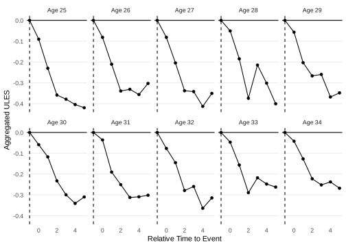
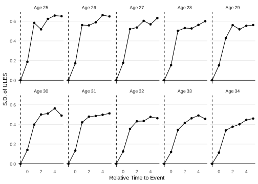

<!-- README.md is generated from README.Rmd. Please edit that file -->

# unitdid

<!-- badges: start -->
<!-- badges: end -->

The `unitdid` package provides a set of functions for the analysis of
the unit-level difference-in-differences (Arkhangelsky, Yanagimoto, and
Zohar, 2024)

## Installation

You can install the development version of unitdid from
[GitHub](https://github.com/) with:

``` r
# install.packages("remotes")
remotes::install_github("kazuyanagimoto/unitdid")
```

## Example

This is a basic example with the simulated `base_heterocp` data set:

``` r
library(unitdid)
library(dplyr)
library(ggplot2)

base_heterocp |>
  head()
#> # A tibble: 6 × 5
#>      id  year byear cyear      y
#>   <int> <int> <int> <int>  <dbl>
#> 1     1  1999  1955  1985 -0.848
#> 2     1  2000  1955  1985  0.759
#> 3     1  2001  1955  1985 -1.03 
#> 4     1  2002  1955  1985  0.858
#> 5     1  2003  1955  1985 -0.866
#> 6     1  2004  1955  1985 -0.651
```

Individual-level child penalties are estimated by `unitdid()`:

``` r
mdl_base <- base_heterocp |>
  unitdid(yname = "y",
        iname = "id",
        tname = "year",
        ename = "cyear",
        bname = "byear")

# Estimated individual-level child penalties (y_tilde)
get_unitdid(mdl_base)
#> # A tibble: 32,257 × 6
#>       id  year byear cyear      y    y_tilde
#>    <int> <int> <int> <int>  <dbl>      <dbl>
#>  1   705  2000  1957  2000 0.138  -0.0287   
#>  2   997  2000  1958  2000 0.138   0.0849   
#>  3   998  2000  1958  2000 0.119  -0.104    
#>  4  1013  2000  1958  2000 0.115  -0.0000709
#>  5  1082  2000  1958  2000 0.0362  0.00549  
#>  6  1127  2000  1958  2000 0.386   0.125    
#>  7  1225  2001  1959  2001 0.158  -0.118    
#>  8  1228  2000  1959  2000 0.241  -0.0937   
#>  9  1228  2001  1959  2000 0.443   0.0226   
#> 10  1230  2000  1959  2000 0.143  -0.0266   
#> # ℹ 32,247 more rows
```

### Aggregation of Individual-level Child Penalties

They can be aggregated to the `full`, `cage` (age at childbirth), and
`cage_byear` (age at childbirth and birth year) levels:

``` r
summary(mdl_base) # default agg = "full"
#> # A tibble: 6 × 3
#>   rel_time    mean     n
#>      <int>   <dbl> <int>
#> 1        0 -0.0653  4357
#> 2        1 -0.193   4357
#> 3        2 -0.307   4357
#> 4        3 -0.310   4357
#> 5        4 -0.350   4357
#> 6        5 -0.349   4357
```

``` r
sum_eage <- summary(mdl_base, agg = "event_age")

sum_eage |>
  filter(rel_time == 0) |>
  mutate(rel_time = -1,
         mean = 0) |>
  bind_rows(sum_eage) |>
  filter(between(event_age, 25, 34)) |>
  mutate(lbl_facet = paste0("Age ", event_age)) |>
  ggplot(aes(x = rel_time, y = mean)) +
  geom_point() +
  geom_line() +
  geom_vline(xintercept = -1, linetype = "dashed") +
  geom_hline(yintercept = 0) +
  facet_wrap(~lbl_facet, ncol = 5) +
  labs(x = "Time to First Childbirth", y = "Child Penalties on y") +
  theme_minimal() +
  theme(panel.grid.major.x = element_blank(),
        panel.grid.minor = element_blank())
```



### Variance of Individual-level Child Penalties

Since the individual-level child penalties are estimated with
measurement errors, the variance of the `y_tilde` is not equal to the
variance of the individual-level child penalties.

The `compute_var` option of the `unitdid` estimates the variance of the
measurement errors and the variance of the individual-level child
penalties by subtracting the variance of the measurement errors from the
variance of `y_tilde`

``` r
mdl_base <- base_heterocp |>
  unitdid(yname = "y",
        iname = "id",
        tname = "year",
        ename = "cyear",
        bname = "byear",
        compute_var = TRUE)

sum_eage <- summary(mdl_base, agg = "event_age")

sum_eage |>
  filter(rel_time == 0) |>
  mutate(rel_time = -1,
         var = 0) |>
  bind_rows(sum_eage) |>
  filter(between(event_age, 25, 34)) |>
  mutate(lbl_facet = paste0("Age ", event_age)) |>
  ggplot(aes(x = rel_time, y = sqrt(var))) +
  geom_point() +
  geom_line() +
  geom_vline(xintercept = -1, linetype = "dashed") +
  geom_hline(yintercept = 0) +
  facet_wrap(~lbl_facet, ncol = 5) +
  labs(x = "Time to First Childbirth", y = "S.D. of Child Penalties") +
  theme_minimal() +
  theme(panel.grid.major.x = element_blank(),
        panel.grid.minor = element_blank())
```


