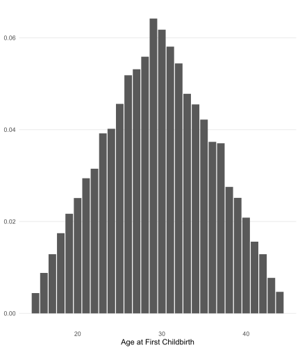
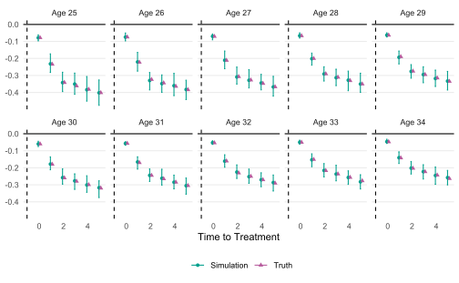
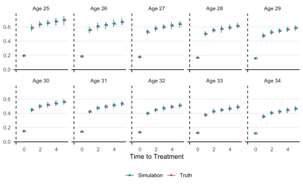

```r
library(indcp)
library(tidyverse)
```

## Data Generation Process

The sample data set `base_indcp` is generated by `indcp::gen_data()` with seed `1234`.

```r
set.seed(1234)
base_indcp <- gen_data()
```

Inside of the function `gen_data()`, the following steps are performed.

### 1. Generate $i = \{1, \dots, 1000\}$ individuals

Generate $i = \{1, \dots, 1000\}$ individuals with age at child birth $a_i$
from a multinomial distribution of $f(a)$.


$$
f(a) = \begin{cases}
\frac{a - 14}{15 \cdot 16} & \text{if } a \in \{15, \dots, 29\} \\
\frac{45 - a}{15 \cdot 16} & \text{if } a \in \{30, \dots, 44\} \\
\end{cases}
$$

```r
base_indcp |>
  distinct(id, .keep_all = TRUE) |>
  summarize(n = n(), .by = cage) |>
  mutate(density = n / sum(n)) |>
  ggplot(aes(x = cage, y = density)) +
  geom_col() +
  labs(x = "Age at First Childbirth", y = NULL) +
  theme_minimal() +
  theme(panel.grid.minor = element_blank(),
        panel.grid.major.x = element_blank())
```

<div class="figure" style="text-align: center">

<p class="caption">plot of chunk unnamed-chunk-2</p>
</div>

### 2. Generate Individual FE $\alpha_i$ and Time FE $\lambda_t$

Generate individual fixed effects $\alpha_i$ and time fixed effects $\lambda_t$ from normal distributions.

$$
\alpha_{i} \sim \mathcal{N}(0.15, 0.1),\, \lambda_{t} \sim \mathcal{N}(0, 0.1)
$$

### 3. Generate Heterogenuous Treatment Effect $\tau_{i, k}$

For individual $i$ with age at first childbirth $a_i$, draw $\tau_{i, k} \sim \mathcal{N}(\mu(a_i, k), \sigma(a_i, k))$ where

$$
\begin{aligned}
\mu(a) &= -1.2 + 0.3\log(a) \\
\sigma(a) &= 2.8 - 0.8\log(a)) \\
\mu(a, k) &= \begin{cases}
\frac{1}{3}\mu(a) & \text{if } k = 0 \\
\mu(a) & \text{if } k = 1 \\
0.05 + 1.5\mu(a) - 0.01k & \text{if } k \ge 2 \\
\end{cases} \\
\sigma(a, k) &= \begin{cases}
\frac{1}{3}\sigma(a) & \text{if } k = 0 \\
\sigma(a) & \text{if } k = 1 \\
0.01 + \sigma(a) + 0.01k & \text{if } k \ge 2 \\
\end{cases}
\end{aligned}
$$

### 4. Generate Outcome $y_{it}$

$$
y_{it} = \alpha_i + \lambda_t + \tau_{i, k} + \varepsilon_{it}
$$

where $\varepsilon_{it} \sim \mathcal{N}(0, 025)$.

## Simulation

To see its estimation properties,
I simulate the data set 100 times and compare the true values with
the mean, 2.5% quantile, and 97.5% quantile of the estimated values.


```r
set.seed(1234)
n_sim <- 100

sim <- function() {
  mdl <- gen_data() |>
  indcp(yname = "y",
        iname = "id",
        tname = "year",
        bname = "byear",
        kname = "rel_time",
        compute_var_me = TRUE)

  summary(mdl, agg = "cage")
}

path_sim <- here::here("vignettes/base_indcp/simulated.rds")

if (!file.exists(path_sim)) {
  simulated <- map(1:n_sim, ~sim(), .progress = TRUE) |>
    list_rbind()
  save(simulated, file = here::here("vignettes/base_indcp/simulated.rds"))
} else {
  load(here::here("vignettes/base_indcp/simulated.rds"))
}
```


```r
val_true <- tibble(
  cage = 25:34,
  tau1 = -1.2 + 0.3 * log(cage),
  sd1 = 3 - 0.75 * log(cage)) |>
  slice(rep(1:n(), each = 6)) |>
  mutate(rel_time = rep(0:5, 10),
         tau = case_when(
           rel_time == 0 ~ tau1 / 3,
           rel_time == 1 ~ tau1,
           rel_time > 1 ~ 0.05 + 1.5 * tau1 - 0.02 * rel_time),
         sd = case_when(
            rel_time == 0 ~ sd1 / 3,
            rel_time == 1 ~ sd1,
            rel_time > 1 ~ 0.01 + sd1 + 0.02 * rel_time),
         lbl = "Truth") |>
  select(-c(tau1, sd1))

df_plot <- simulated |>
  rename(tau = mean_y_tilde,
         sd = sd_y_tilde_estimated) |>
  summarize(across(c(tau, sd), list("lci" = ~quantile(.x, 0.025),
                                    "rci" = ~quantile(.x, 0.975))),
            across(c(tau, sd), mean),
            .by = c(cage, rel_time)) |>
  mutate(lbl = "Simulation") |>
  bind_rows(val_true) |>
  mutate(lbl_facet = paste0("Age ", cage)) |>
  filter(between(cage, 25, 34))
```

### Mean of $\tau_{ik}$


```r
df_plot |>
  ggplot(aes(x = rel_time, y = tau, ymin = tau_lci, ymax = tau_rci,
           color = lbl, shape = lbl)) +
  geom_point(position = position_dodge(width = 0.3)) +
  geom_errorbar(width = 0.2, position = position_dodge(width = 0.3)) +
  geom_vline(xintercept = -1, linetype = "dashed") +
  geom_hline(yintercept = 0) +
  scale_color_manual(values = c("#009F8C", "#B75C9D")) +
  facet_wrap(~lbl_facet, ncol = 5) +
  labs(x = "Time to Treatment", y = NULL, color = NULL, shape = NULL) +
  theme_minimal() +
  theme(panel.grid.minor = element_blank(),
        panel.grid.major.x = element_blank(),
        legend.position = "bottom")
```

<div class="figure" style="text-align: center">

<p class="caption">plot of chunk unnamed-chunk-4</p>
</div>

### Standard Deviation of $\tau_{ik}$


```r
df_plot |>
  ggplot(aes(x = rel_time, y = sd, ymin = sd_lci, ymax = sd_rci,
           color = lbl, shape = lbl)) +
  geom_point(position = position_dodge(width = 0.3)) +
  geom_errorbar(width = 0.2, position = position_dodge(width = 0.3)) +
  geom_vline(xintercept = -1, linetype = "dashed") +
  geom_hline(yintercept = 0) +
  scale_color_manual(values = c("#009F8C", "#B75C9D")) +
  facet_wrap(~lbl_facet, ncol = 5) +
  labs(x = "Time to Treatment", y = NULL, color = NULL, shape = NULL) +
  theme_minimal() +
  theme(panel.grid.minor = element_blank(),
        panel.grid.major.x = element_blank(),
        legend.position = "bottom")
```

<div class="figure" style="text-align: center">

<p class="caption">plot of chunk unnamed-chunk-5</p>
</div>


