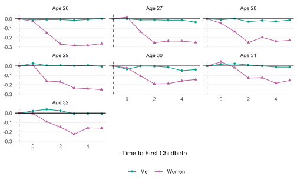
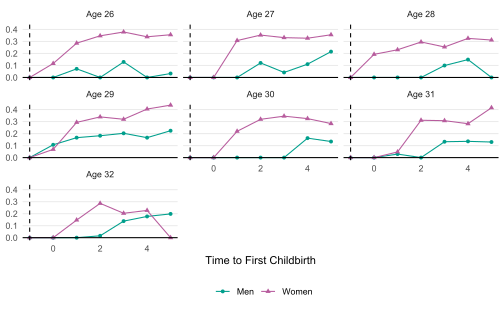

```r
library(indcp)
library(here)
library(dplyr)
library(ggplot2)
library(haven)
```

### Panel Study of Income Dynamics (PSID)

The PSID data is a longitudinal household survey of the United States
and one of the longest and most famous panel surveys in the world.
The study began in 1968 with a nationally representative sample of over 18,000
individuals living in 5,000 families.
The data is available [here](https://psidonline.isr.umich.edu) for the registered users.

To avoid the convoluted cleaning tasks,
I mostly use the cleaning codes provided by the [Comparative Panel File (CPF)](https://www.cpfdata.com).
Their cleaning [codes](https://www.cpfdata.com) are developed
for creating a harmonized panel data of seven countries
(Australia, Germany, the UK, South Korea, Russia, Switzerland, and the US).

To replicate this article, you need to run

1. Run the code of the CPF only for the PSID
    - In step 4 (Add vars constant across all waves) of the `CPF-Code/03_PSID/us_01_3_GEt_vars.do`, add `ER32024` (birth year of the first child)
    - `us_01.dta`-`us_03.dta` will be produced
1. Run the following code to create a dataset for the child penalties


```r
cpf_us01 <- read_dta(here("vignettes/example_psid/us_01.dta"))
cpf_us03 <- read_dta(here("vignettes/example_psid/us_03_CPF.dta"))

ever_birth <- cpf_us01 |>
  select(pid, cyear = ER32024) |>
  filter(cyear != 9999) |>
  distinct()

cp_psid <- cpf_us03 |>
  filter(country == 3) |>
  select(id = pid,
         year = intyear,
         byear = yborn,
         gender = female,
         earn = incjobs_yg,
         hours = whweek) |>
  mutate(gender = if_else(gender == 0, "Men", "Women"),
         particip = if_else(hours > 0, 1, 0),
         wage = if_else(particip == 1, earn / hours, 0)) |>
  right_join(ever_birth, by = c("id" = "pid")) |>
  mutate(rel_time = year - cyear) |>
  filter(!is.na(earn))

save(cp_psid, file = here("vignettes/example_psid/cp_psid.rds"))
```

## Analysis of Child Penalties on Participation


```r
load(here("vignettes/example_psid/cp_psid.rds"))

cp_psid <- cp_psid |>
  mutate(cage = cyear - byear) |>
  filter(cyear >= 1968,
         year <= 1997, # The last year of the annual data
         between(cage, 22, 40)) # The Age range of the first childbirth
```


```r
mdl_particip_m <- cp_psid |>
  filter(gender == "Men") |>
  indcp(yname = "particip",
        iname = "id",
        tname = "year",
        bname = "byear",
        kname = "rel_time",
        compute_var_me = TRUE)

mdl_particip_f <- cp_psid |>
  filter(gender == "Women") |>
  indcp(yname = "particip",
        iname = "id",
        tname = "year",
        bname = "byear",
        kname = "rel_time",
        compute_var_me = TRUE)
```

### Mean of Child Penalties on Participation


```r
sum_particip_m <- summary(mdl_particip_m, agg = "cage") |>
  mutate(gender = "Men")
sum_particip_f <- summary(mdl_particip_f, agg = "cage") |>
  mutate(gender = "Women")

sum_particip <- bind_rows(sum_particip_m, sum_particip_f) |>
  filter(between(cage, 22, 30))

df_plot <- sum_particip |>
  filter(rel_time == 0) |>
  mutate(rel_time = -1, mean_particip_tilde = 0,
         sd_particip_tilde_estimated = 0) |>
  bind_rows(sum_particip) |>
  mutate(lbl_facet = paste0("Age ", cage))

df_plot |>
  ggplot(aes(x = rel_time, y = mean_particip_tilde,
             color = gender, shape = gender)) +
  geom_point() +
  geom_line() +
  geom_vline(xintercept = -1, linetype = "dashed") +
  geom_hline(yintercept = 0) +
  facet_wrap(~lbl_facet) +
  scale_color_manual(values = c("#009F8C", "#B75C9D")) +
  labs(x = "Time to First Childbirth",
       y = NULL,
       color = NULL, shape = NULL) +
  theme_minimal() +
  theme(panel.grid.minor = element_blank(),
        panel.grid.major.x = element_blank(),
        legend.position = "bottom")
```

<div class="figure" style="text-align: center">

<p class="caption">plot of chunk mean_cage</p>
</div>

### Standard Deviation of Child Penalties on Participation


```r
df_plot |>
  ggplot(aes(x = rel_time, y = sd_particip_tilde_estimated,
             color = gender, shape = gender)) +
  geom_point() +
  geom_line() +
  geom_vline(xintercept = -1, linetype = "dashed") +
  geom_hline(yintercept = 0) +
  facet_wrap(~lbl_facet) +
  scale_color_manual(values = c("#009F8C", "#B75C9D")) +
  labs(x = "Time to First Childbirth",
       y = NULL, color = NULL, shape = NULL) +
  theme_minimal() +
  theme(panel.grid.minor = element_blank(),
        panel.grid.major.x = element_blank(),
        legend.position = "bottom")
```

<div class="figure" style="text-align: center">

<p class="caption">plot of chunk sd_cage</p>
</div>
